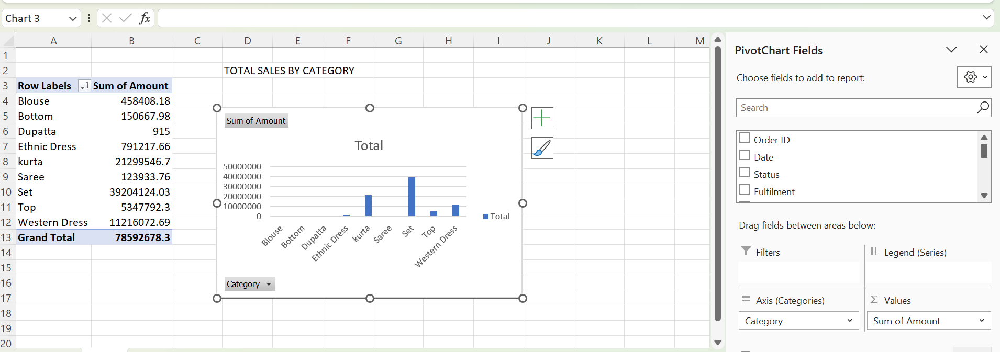
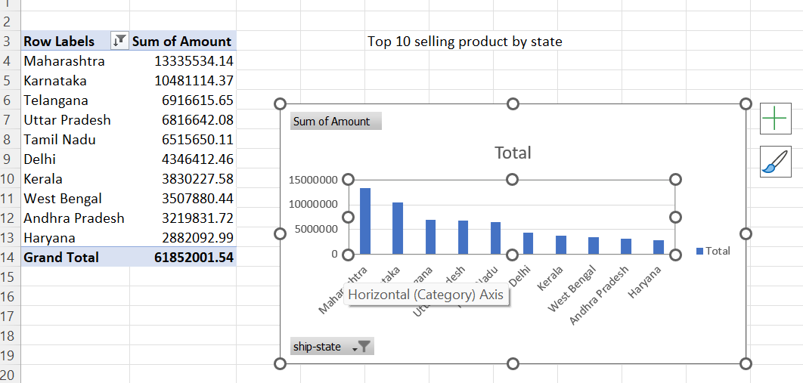
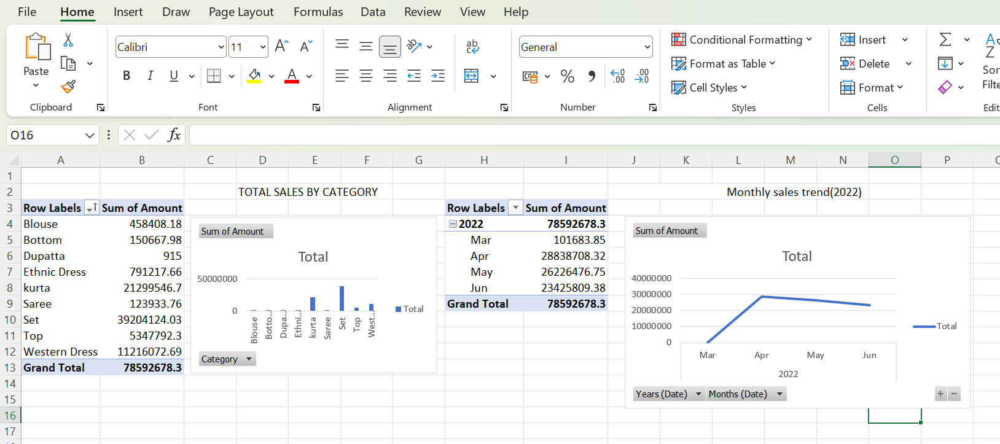
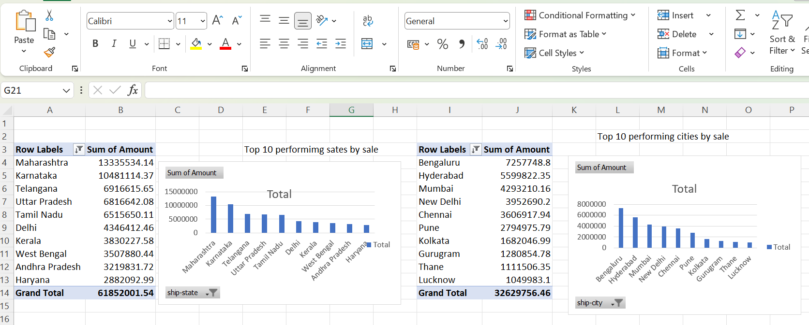
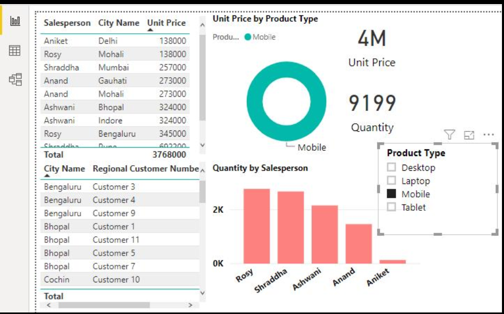

# Amazan-sales-analysis
Amazon India sales data turned into an interactive Excel/Power BI-driven dashboard.

📊 Sales Analysis Dashboard
A sales analysis project built using Excel PivotTables/PivotCharts and Power BI, exploring sales performance by category, state, city, and month.

🛠️ Tools Used

Microsoft Excel (PivotTables & PivotCharts)
Power BI (Interactive Dashboard)

📈 What's Included

Total Sales by Category
Top 10 Selling States
Top 10 Performing Cities
Monthly Sales Trend (2022)
Power BI Dashboard with Salesperson, City, and Product Type filters

🖼️ Screenshots

Total Sales by Category

Top 10 Selling States

Category & Monthly Trend

Top States & Cities

Power BI Dashboard

🔍 Key Insights

Set and Kurta are the top-selling categories.
Maharashtra, Karnataka, and Telangana lead in sales.
Bengaluru and Hyderabad are the top-performing cities.
Sales peaked in April 2022.

🚀 How to Use

Clone the repo
Open the Excel file to explore PivotTables/Charts
Open the .pbix file in Power BI Desktop to interact with the dashboard

🙋 Author

MONISHA — GitHub: https://github.com/hasinimoni/Amazan-sales-analysis
